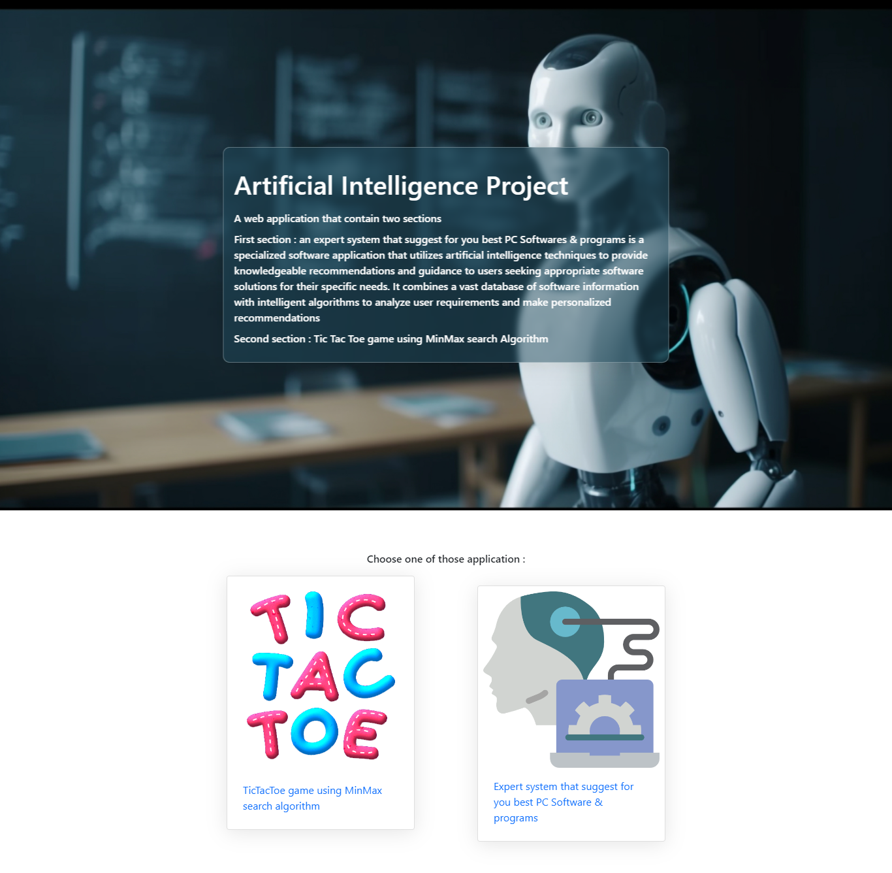
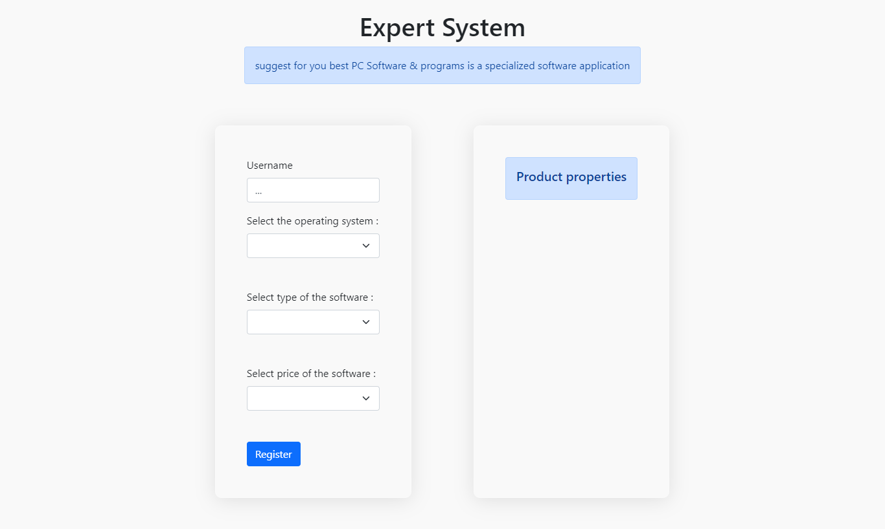
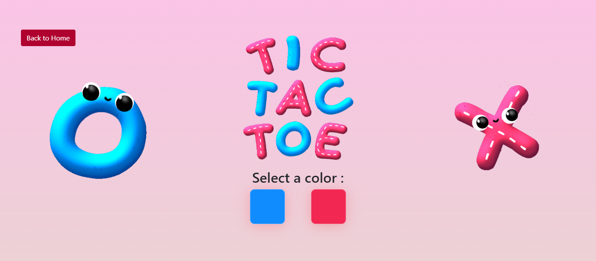
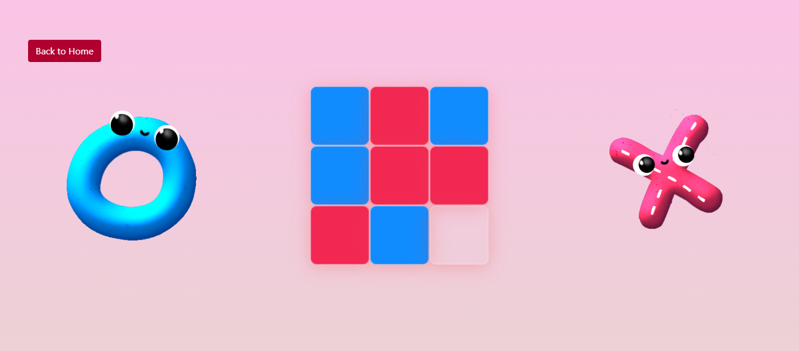

# AI_PROJECT

# Description
 A web application that contain two sections
#### First section : 
 an expert system that suggest for you best PC Software & programs  is a specialized software application that utilizes artificial intelligence techniques to provide knowledgeable recommendations and guidance to users seeking appropriate software solutions for their specific needs. It combines a vast database of software information with intelligent algorithms to analyze user requirements and make personalized recommendations 
#### Second section : 
Tic Tac Toe game using MinMax search Algorithm

## Screenshots







### Installation

1. Clone the repository: `git clone https://github.com/KamelTouati/AI_PROJECT`
2. Navigate to the project directory: `cd flask-project`
3. Create and activate a virtual environment (optional but recommended):
   - For Windows (using Command Prompt):
     ```
     python -m venv venv
     venv\Scripts\activate
     ```
   - For macOS/Linux:
     ```
     python3 -m venv venv
     source venv/bin/activate
     ```
4. Install the required packages: `pip install flask`
5. Set the Flask app and environment variables:
   - For Windows (using Command Prompt): `set FLASK_APP=app.py` and `set FLASK_ENV=development`
   - For macOS/Linux: `export FLASK_APP=app.py` and `export FLASK_ENV=development`
6. Run the Flask app: `flask run`
7. Open your web browser and visit `http://localhost:5000` to access the application.


## Technologies Used
<a href="https://www.w3.org/html/" target="_blank" rel="noreferrer">  </a><a href="https://www.w3schools.com/css/" target="_blank" rel="noreferrer"> </a><a href="https://developer.mozilla.org/en-US/docs/Web/JavaScript" target="_blank" rel="noreferrer"> </a>

## Contributions

Contributions are welcome! If you have any ideas or suggestions, feel free to open an issue or submit a pull request.

## Contact Information

For any questions or feedback, please contact [Benlala Raid Athmane](mailto:r_benlala@estin.dz).
